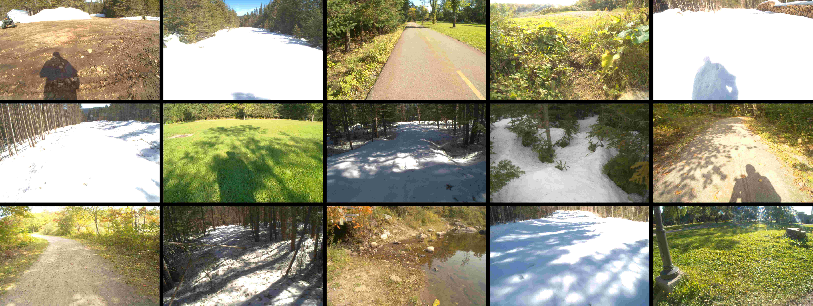
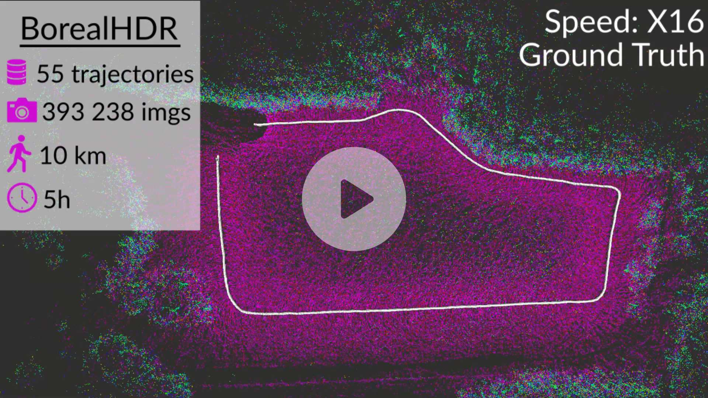

<p float="center">
  
</p>

# Exposing the Unseen: Exposure Time Emulation for Offline Benchmarking of Vision Algorithms

[](https://doi.org/10.48550/arXiv.2309.13139)

This repository contains the code used in our paper *Exposing the Unseen: Exposure Time Emulation for Offline Benchmarking of Vision Algorithms* submitted at IROS2024. 

[](https://youtu.be/btkO12L6AYs)


## Menu

  - [**Emulator**](#emulator)

  - [**BorealHDR Dataset**](#borealhdr-dataset)

  - [**Citing**](#citing)


## Emulator

We created a Dockerfile to easily run our code using a docker-compose.yaml.

If you have downloaded the dataset in another directory, the first step is to modify the last line of `.devcontainer/docker-compose.yaml` to mount the location of your data into the container at `/home/user/code/dataset_mount_point/`. If you did not download the dataset, we added a small part of a trajectory direclty into this repository to enable testing our pipeline.

Then, you can open the devcontainer in `vscode`, or build the image with `docker compose up --build`.

When your inside the docker container, you can direclty emulate images from the dataset by running

```bash
cd /home/user/code/scripts/
python3 emulator_threads.py
```
The `emulator_threads.py` loads `parameters.yaml` file. You can adapt some parameters to choose which automatic-exposure technique to use and also some debugs parameters. Note that `emulator_threads.py` uses multiple threads to accelerate the processes. You can then emulate multiple automatic-exposure algorithms by un-commenting methods in `automatic_exposure_techniques` from `parameters.yaml`.

The default folder for the results from the emulation is at `/home/user/code/output/emulated_images/`.

## BorealHDR Dataset


**Due to its size, the entire BorealHDR dataset is in preparation. It will be added soon!**

The BorealHDR Dataset was acquired at the Montmorency Forest in Québec City, Canada.
In winter, this environment creates several HDR scenes coming from snow and trees.
It was developed mainly to be used with our emulation technique.

The images were collected using the bracketing technique with six exposure times: **1, 2, 4, 8, 16, and 32 ms**.
A ground truth is provided using the 3D lidar data and a lidar-inertial-SLAM algorithm based on [Libpointmatcher](https://github.com/norlab-ulaval/libpointmatcher).

BorealHDR contains:

    - 55 trajectories
    - 10 km
    - 5 hours of data
    - 393 238 images
    - Ground truth 3D maps
    - 3D lidar point clouds
    - IMU measurements
    - GPS data


## Citing

If you use our emulator or our BorealHDR dataset in your work, please cite [our preprint](https://doi.org/10.48550/arXiv.2309.13139):

```bibtex
@misc{gamache2023exposing,
      title={{Exposing the Unseen: Exposure Time Emulation for Offline Benchmarking of Vision Algorithms}}, 
      author={Olivier Gamache and Jean-Michel Fortin and Matěj Boxan and Maxime Vaidis and François Pomerleau and Philippe Giguère},
      year={2023},
      eprint={2309.13139},
      archivePrefix={arXiv},
      primaryClass={cs.RO}
}
```
